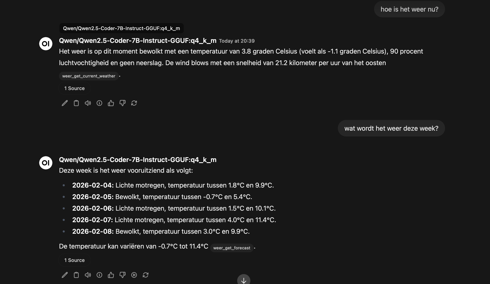

# Een MCP Weather Server bouwen voor OpenWebUI

Recentelijk wilde ik mijn OpenWebUI setup uitbreiden met real-time weersinformatie. In plaats van een externe API direct aan te roepen, besloot ik een **Model Context Protocol (MCP)** server te bouwen. Dit geeft een schone integratie en laat de AI zelf bepalen wanneer weerdata nodig is.

In deze post neem ik je mee door het hele proces: van concept tot werkende implementatie.

## Het Probleem

OpenWebUI is geweldig voor lokale AI assistenten, maar standaard heeft het geen toegang tot real-time data zoals het weer. Ik wilde dat mijn AI assistent vragen kon beantwoorden zoals:

- "Hoe is het weer nu?"
- "Moet ik morgen een paraplu meenemen?"
- "Wat wordt het weer deze week?"

De oplossing? Een MCP server die als brug fungeert tussen OpenWebUI en de OpenMeteo API.

## Wat is MCP?

Het **Model Context Protocol** is ontwikkeld door Anthropic als een gestandaardiseerde manier om LLMs te verbinden met externe tools en data sources. Het werkt via een simpel JSON-RPC protocol en ondersteunt:

- Tool discovery (`tools/list`)
- Tool execution (`tools/call`)
- Bidirectionele communicatie via SSE of stdio

Perfect voor onze use case!

## De Architectuur

Mijn oplossing bestaat uit drie lagen:

```
OpenWebUI → MCP Server → OpenMeteo API
```

De MCP server draait in een Docker container en exposeert drie tools:

1. **get_temperature** - Simpele temperatuur lookup
2. **get_current_weather** - Uitgebreid actueel weer (temp, vocht, wind, neerslag)
3. **get_forecast** - 5-daagse weersverwachting

## Implementatie: De MCP Server

### Project Setup

Eerst maakte ik een simpele Python project structuur:

```
weer-mcp/
├── src/
│   └── weather_server.py
├── Dockerfile
├── docker-compose.yml
└── requirements.txt
```

De dependencies zijn minimaal:

```txt
mcp>=1.0.0
httpx>=0.27.0
uvicorn>=0.30.0
starlette>=0.37.0
```

### De Server Code

De kern van de server is verrassend compact. Hier is een voorbeeld van de `get_current_weather` tool implementatie:

```python
# Weather code descriptions (WMO codes) in het Nederlands
WEATHER_CODES = {
    0: "Helder",
    1: "Overwegend helder",
    2: "Gedeeltelijk bewolkt",
    3: "Bewolkt",
    61: "Lichte regen",
    63: "Matige regen",
    65: "Zware regen",
    95: "Onweer",
    # ... meer codes
}

# MCP Tool handler
elif tool_name == "get_current_weather":
    async with httpx.AsyncClient() as client:
        api_response = await client.get(
            "https://api.open-meteo.com/v1/forecast",
            params={
                "latitude": 51.836316614873176,
                "longitude": 5.79300494667676,
                "current": "temperature_2m,apparent_temperature,"
                          "relative_humidity_2m,precipitation,"
                          "weather_code,wind_speed_10m,wind_direction_10m",
                "timezone": "Europe/Amsterdam"
            }
        )
        api_data = api_response.json()

    current = api_data["current"]

    result_text = f"""Actueel weer:
🌡️ Temperatuur: {current['temperature_2m']}°C
💧 Luchtvochtigheid: {current['relative_humidity_2m']}%
💨 Wind: {current['wind_speed_10m']} km/u
☁️ Conditie: {get_weather_description(current['weather_code'])}"""
```

### MCP Protocol Implementatie

Het MCP protocol werkt via JSON-RPC over HTTP/SSE. De server moet drie belangrijke methods afhandelen:

```python
if method == "initialize":
    # Handshake met client
    return {
        "protocolVersion": "2025-11-25",
        "capabilities": {"tools": {}},
        "serverInfo": {"name": "weather-server", "version": "2.0.0"}
    }

elif method == "tools/list":
    # Lijst van beschikbare tools
    return {
        "tools": [
            {
                "name": "get_temperature",
                "description": "Get current temperature...",
                "inputSchema": {"type": "object", "properties": {}}
            },
            # ... meer tools
        ]
    }

elif method == "tools/call":
    # Tool execution
    tool_name = data["params"]["name"]
    # Execute tool en return result
```

### Docker Container

Voor deployment gebruikte ik een simpele Dockerfile:

```dockerfile
FROM python:3.11-slim

WORKDIR /app

COPY requirements.txt .
RUN pip install --no-cache-dir -r requirements.txt

COPY src/ ./src/

CMD ["python", "src/weather_server.py"]
```

En een `docker-compose.yml` voor eenvoudig beheer:

```yaml
services:
  weather-mcp:
    build: .
    container_name: weather-mcp-server
    restart: unless-stopped
    ports:
      - "8000:8000"
```

## OpenWebUI Integratie

Het koppelen aan OpenWebUI was verrassend eenvoudig. In de OpenWebUI settings:

1. **Type:** MCP Streamable HTTP
2. **URL:** `http://192.168.x.x:8000/sse`
3. Save

En dat is alles! OpenWebUI detecteert automatisch de beschikbare tools.

## Het Resultaat



De AI assistent kan nu intelligent weerdata opvragen. Vraag ik "Hoe is het weer?", dan gebruikt het automatisch de `get_current_weather` tool. Bij "Wat wordt het weer morgen?" gebruikt het `get_forecast`.

Voorbeeld conversatie:

**User:** "Hoe is het weer nu?"

**AI:** *[calls get_current_weather tool]*

"Het is momenteel 3.8°C met een luchtvochtigheid van 82%. Er is op dit moment geen neerslag en het waait met 15 km/u uit het zuidwesten. Het is bewolkt."

## Technische Details

### Waarom OpenMeteo?

OpenMeteo is een geweldige keuze voor weer data:

- ✅ Volledig gratis
- ✅ Geen API key nodig
- ✅ Uitstekende documentatie
- ✅ Hoge nauwkeurigheid
- ✅ Forecast tot 16 dagen vooruit

### Performance

De server is opzettelijk simpel gehouden:

- Async/await voor non-blocking API calls
- Directe OpenMeteo queries (geen caching nodig voor realtime data)
- Minimale dependencies
- ~50ms response tijd

### Nederlandse Weercodes

Een leuk detail: ik heb alle WMO weather codes vertaald naar het Nederlands. Dit geeft een veel natuurlijkere ervaring:

```python
WEATHER_CODES = {
    0: "Helder",
    45: "Mist",
    61: "Lichte regen",
    95: "Onweer",
    99: "Onweer met zware hagel"
}
```

## Lessons Learned

### 1. MCP is Elegant

Het MCP protocol is verrassend elegant. Door tools te definiëren in plaats van hardcoded functionaliteit, kan de AI intelligent beslissen wanneer welke data nodig is.

### 2. Docker is Essential

Docker maakte deployment triviaal. De hele server draait in één container en kan overal worden uitgerold.

### 3. Keep It Simple

Mijn eerste implementatie was te complex. Door terug te gaan naar basics (geen caching, geen database, geen over-engineering) kreeg ik een robuustere en makkelijker te onderhouden oplossing.

## Mogelijke Uitbreidingen

De huidige implementatie werkt perfect, maar er zijn leuke uitbreidingen mogelijk:

### 1. Locatie Parameters

Nu is de locatie hardcoded. Een parameter systeem zou meerdere locaties mogelijk maken:

```python
"inputSchema": {
    "type": "object",
    "properties": {
        "location": {
            "type": "string",
            "description": "City name or coordinates"
        }
    }
}
```

### 2. Meer Weather Data

OpenMeteo biedt veel meer data:
- UV index
- Zonsopgang/ondergang
- Luchtdruk
- Zichtbaarheid
- Cloud coverage

### 3. Alerts & Notifications

Weeralerts en waarschuwingen zouden waardevol zijn:

```python
def get_weather_alerts():
    # Check voor extreme weer
    if wind_speed > 75:
        return "⚠️ Stormwaarschuwing!"
```

### 4. Historical Data

OpenMeteo ondersteunt ook historische data. Ideaal voor analyses:

```python
def get_weather_history(date: str):
    # Haal weer data op voor specifieke datum
    pass
```

## Code & Resources

De volledige source code staat op mijn [GitHub](https://github.com/jeroenklaver/weer-mcp). Voel je vrij om het te forken en aan te passen voor je eigen use case!

**Handige links:**
- [OpenMeteo API Documentatie](https://open-meteo.com/en/docs)
- [MCP Protocol Specificatie](https://modelcontextprotocol.io/)
- [OpenWebUI](https://github.com/open-webui/open-webui)

## Conclusie

Het bouwen van een MCP server voor OpenWebUI was een leerzame ervaring. De combinatie van het elegante MCP protocol, de krachtige OpenMeteo API, en de flexibiliteit van OpenWebUI resulteert in een seamless integratie.

De server draait nu 24/7 en beantwoordt moeiteloos weergerelateerde vragen. Het mooiste? De AI beslist zelf wanneer weerdata nodig is en roept dan automatisch de juiste tool aan.

Heb je vragen of heb je zelf een MCP server gebouwd? Laat het weten in de comments!

---

*Geschreven op 4 februari 2026 met hulp van Claude Sonnet 4.5*
